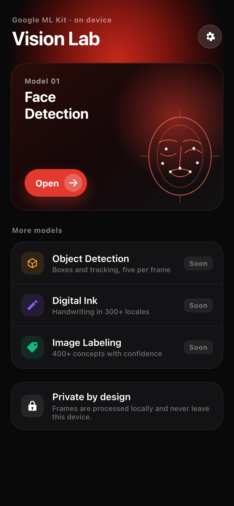
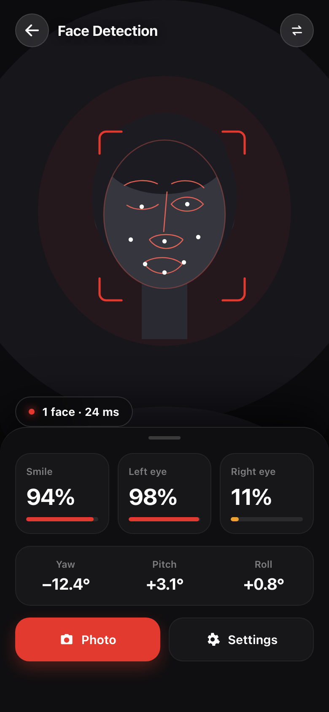
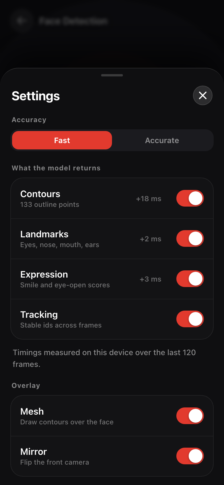

# Vision Lab

A Flutter playground for Google ML Kit's on-device vision models. Four models,
each mounted as its own instrument: live input, a drawn read of what the model
returns, and the telemetry behind it.

Everything runs locally. No frame ever leaves the device.

| | Model | What it answers |
|---|---|---|
| 01 | **Face Detection** | Where are the faces, and what are they doing? Contours, landmarks, head pose, expression |
| 02 | **Object Detection** | Where is it, and is it the same thing as last frame? Boxes and stable tracking ids |
| 03 | **Digital Ink** | What did I just write? Handwriting and sketches, 300+ locales |
| 04 | **Image Labeling** | What am I looking at? ~400 concepts with confidence |

## Screens

| Deck | Face Detection | Settings |
|---|---|---|
|  |  |  |

## Running it

```sh
flutter pub get
flutter run
```

**A physical device is required.** ML Kit 9.0 ships fat frameworks with no
arm64-simulator slice, so iOS simulator builds fail at link time with a
misleading `framework 'Pods_Runner' not found`. Three of the four models need a
camera anyway.

On an Apple Silicon Mac, `flutter run` to a physical iPhone also needs Rosetta —
Flutter's `iproxy` helper is an x86_64 binary:

```sh
sudo softwareupdate --install-rosetta --agree-to-license
```

Digital Ink downloads a language model on first use, so that one screen needs a
network connection once. After that it is offline like the rest.

## How it is put together

```
lib/
  core/
    camera/     the capture rig; CameraImage to InputImage, no pixel copies
    geometry/   maps detector output onto the preview
    vision/     the viewport panel both camera modules share
  design/       palette, type scale, and the widgets built from them
  features/     one folder per model, each owning its channel, controller and screen
  modules/      the catalog the deck is built from
```

Adding a model means a folder under `features/` and an entry in the catalog.
The camera rig, the coordinate mapping and the viewport are already shared.

### Two things worth reading the code for

**Coordinate mapping.** `core/geometry/frame_mapper.dart` is where most ML Kit
demos go wrong. Android delivers a landscape sensor buffer plus a rotation; iOS
delivers an already-upright buffer while still reporting a 90 degree sensor
orientation. Normalising by shape rather than by trusting the rotation handles
both, and the preview is cover-fitted into a box of exactly the upright size so
the overlay lines up with the pixels.

**Measured option costs.** `features/face/latency_ledger.dart` averages frame
latency per option-set, so the settings sheet can tell you that contours cost
`+18 ms` on *this* device. It reports nothing until both sides of the comparison
have actually been timed — it never estimates.

## A note on the ML Kit Dart wrappers

Three of the four plugins parse the platform's confidence or score straight into
a non-nullable `double`:

```dart
// google_mlkit_digital_ink_recognition, _object_detection, _image_labeling
score: json['score'],   // throws if the channel delivers an int
```

Because the throw happens inside the parsing loop it discards *every* result in
the frame, not just the offending one — on a live stream, that is every frame.
This project talks to those three method channels directly and parses with
`num.toDouble()`. See `features/*/*_channel.dart`, each with tests covering the
int case.

## Tests

```sh
flutter test
```

Unit tests cover the channel parsing and the latency ledger. Golden tests render
the readout sections to PNG so layout can be reviewed without a device — they
caught two real bugs before they shipped. Run `flutter test --update-goldens`
after any deliberate visual change.
